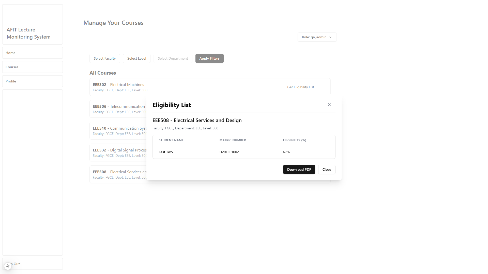

# AFIT Lecture Monitoring System

With this system, Quality Assurance teams, need not to move from lecture room to lecture room to manually collect lecture data such as number of participating students and available lecturers. This manual process was time consuming and error prone.
The deployment can be scaled horizontally depending on the size of the use case area and coverage.

System Design:

