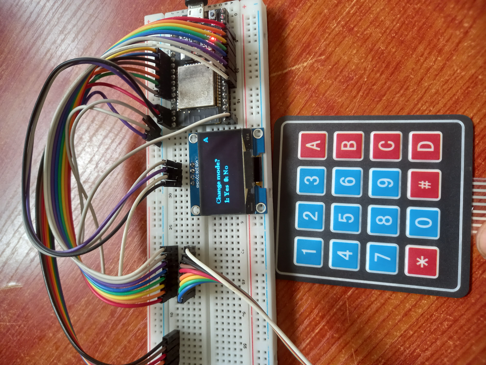

# AFIT LMS Embedded Program for Attendance Terminals

This directory contains the code that programs the attendance terminals.

This terminal operates in two modes:

- Attendance Mode  
- Enrollment Mode  

The Attendance Mode which is the default mode, displays a list of courses which can be selected by the lecturer to record lecture details for.
While, the enrollment mode is a temporary feature shared by one terminal because enrollment devices have to be separate to operate the system properly. In this mode a new user can be registered to the system and assigned an indentification tag.
